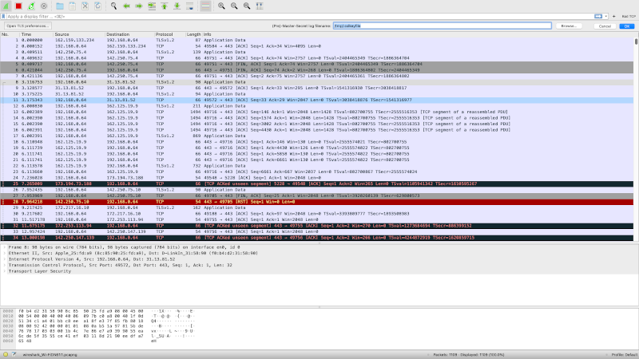

# NetMo(Network Monitor)

##Introduction:

In a time where one's life is seamlessly integrated with the internet,
and more of our time is spent browsing the world wide web. 
it is essential to be knowledgeable  of network traffic in one's personal network.

Some of the benefits of monitoring your personal network are:

	*ability to know what parties your or other people's
	 machines are communicating with over the internet

	*the ability as a parent to monitor the internet activity
	 or your children, to better protect them from the wild
	 wasteland that is the internet

	*picking out any unusual activity from your device, 
	 that could be an indication of a compromise in your
	 machine's security

Many tools exist that are focused on network monitoring, and network packet analysis,
 some of them are accusable threw a paywall, others are open source. 
 the one that is by far the most widespread, and ubiquitous is Wireshark.

Wireshark offers to the user near endless capabilities when it comes to network monitoring,
 and packet analysis, at the extremally competitive price of 0$. the main issue with Wireshark
 is the high barrier of entry in terms of expertise.  
 if you are not a person who is well versed in the realm of networking, Wireshark to you is as
 useful as a digital paperweight.

It could be easily argued that people who need the ability to monitor their networks the most,
 are the people who are not able to use Wireshark.

A regular everyday user, someone who only wants to  monitor the internet activity of others in their network,
 or just check-in on their personal machine, dont need the full power of Wireshark,
 and they could be easily overwhelmed.

##Example of Wireshark:

