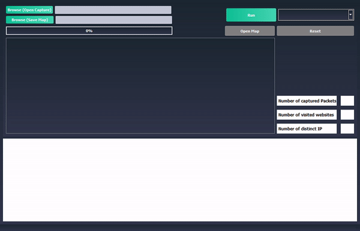
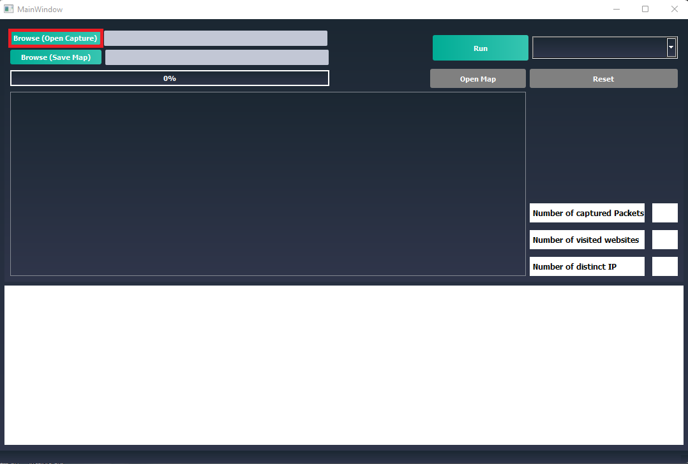
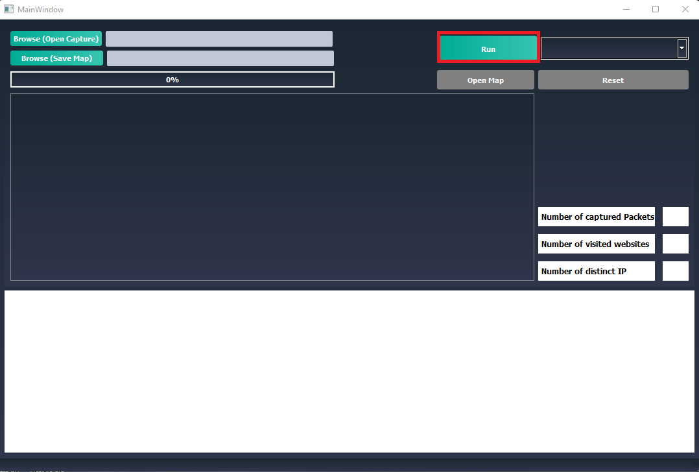
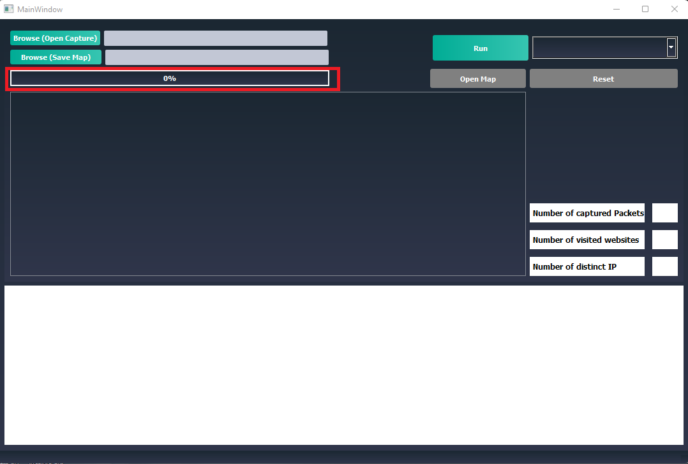
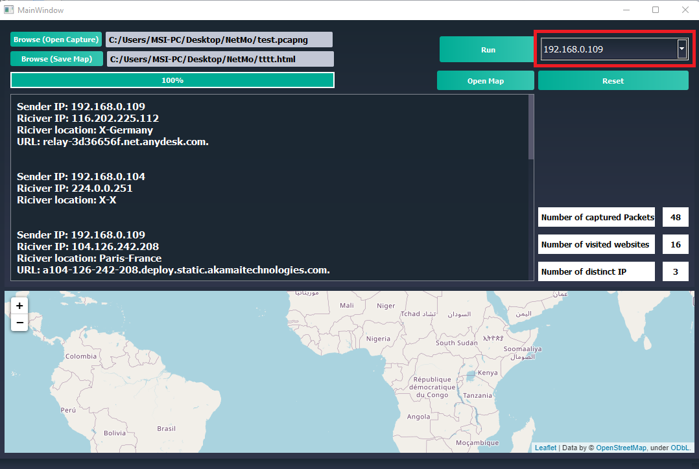
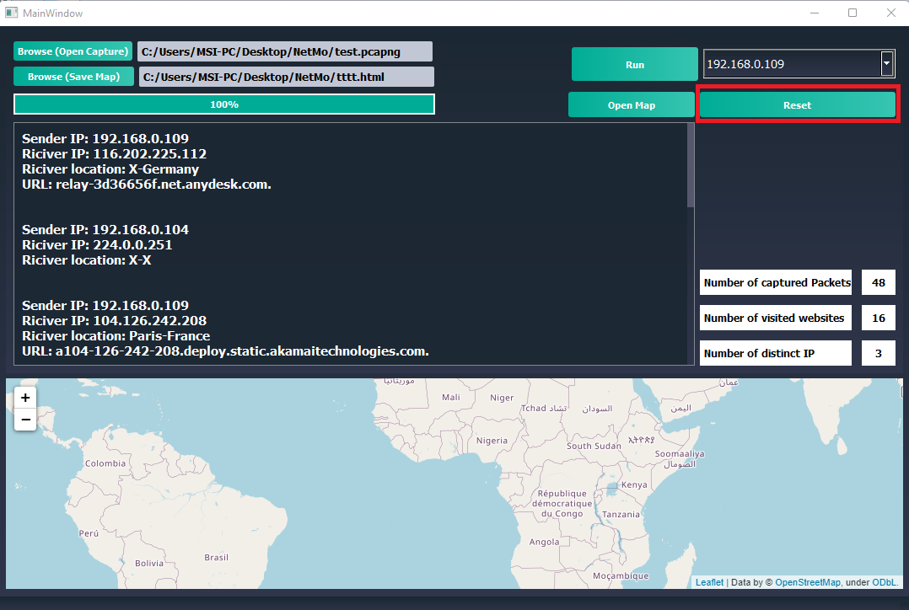
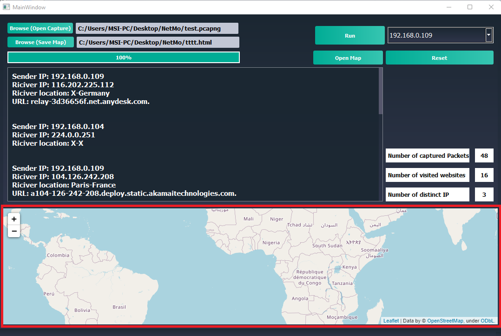
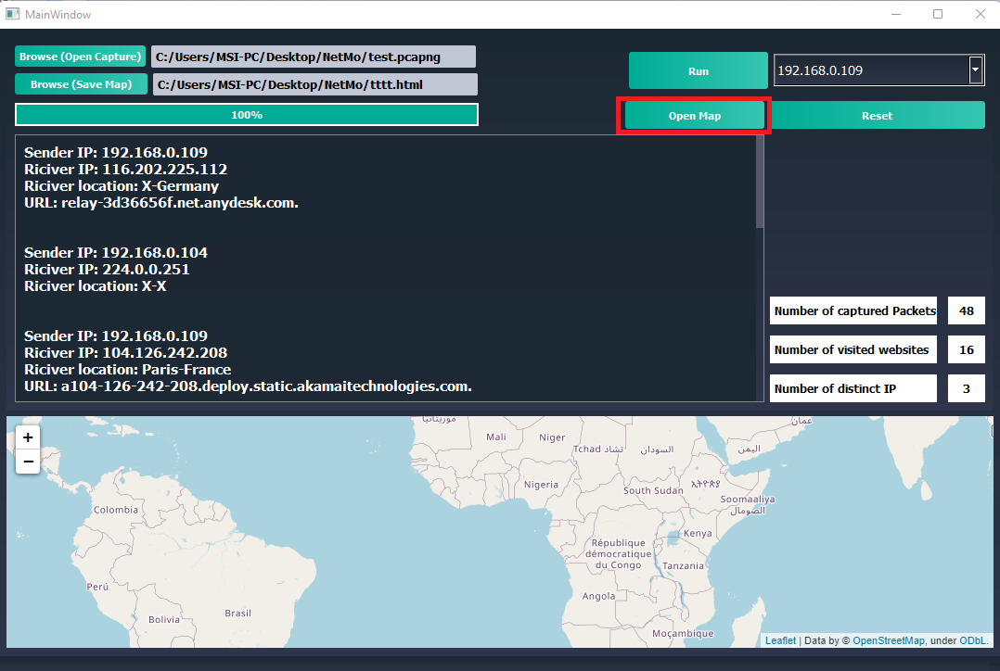

# NetMo(Network Monitor)


## Introduction:


In a time where one's life is seamlessly integrated with the internet,
and more of our time is spent browsing the world wide web. 
it is essential to be knowledgeable  of network traffic in one's personal network.


Some of the benefits of monitoring your personal network are:


	*ability to know what parties your or other people's
	 machines are communicating with over the internet

	*the ability as a parent to monitor the internet activity
	 or your children, to better protect them from the wild
	 wasteland that is the internet


	*picking out any unusual activity from your device, 
	 that could be an indication of a compromise in your
	 machine's security


Many tools exist that are focused on network monitoring, and network packet analysis,
 some of them are accusable threw a paywall, others are open source. 
 the one that is by far the most widespread, and ubiquitous is Wireshark.


Wireshark offers to the user near endless capabilities when it comes to network monitoring,
 and packet analysis, at the extremally competitive price of 0$. the main issue with Wireshark
 is the high barrier of entry in terms of expertise.  
 if you are not a person who is well versed in the realm of networking, Wireshark to you is as
 useful as a digital paperweight.


It could be easily argued that people who need the ability to monitor their networks the most,
 are the people who are not able to use Wireshark.

A regular everyday user, someone who only wants to  monitor the internet activity of others in their network,
 or just check-in on their personal machine, dont need the full power of Wireshark,
 and they could be easily overwhelmed.


## Example of Wireshark:


## introduction to NetMo:
NetMo(Network Monitor) is a program aiming at bringing the benefits of Wireshark to the regular user, with as little fuss as   possible. it aims to show the user what they need, in simple terms, and in ease of accessibility.

It also builds over what Wireshark offers by having IP Geolocation capabilities, which tells the user the location of the destination of each packet, and plots it on a map for them. it also adds to the packet the DNS response of the destination IP address if one existed.

NeMo takes a file that was captured by Wireshark, and turns it from a hard to understand complicated overload of information, to a simple useful  and easy to understand format, and adds on top of what has already been captured by Wireshark.




## Live Capture:

currently NetMo is not fully standalone, due to the fact that live capture capabilities have not been added, this was brought about by the incompatibility of pyshark( a module that offers the power of Wireshark in python) with windows, in the future live capture will be added to a version of NetMo that is Linux based, and if pyshark live capture becomes compatible with windows in the future that feature will be added to the Windows version. 


## How to run the program?
This program uses pyshark,Abstract-python-ip-geolocation,Dnspython,pyqt5,PyQtWebEngine,folium,pandas. To install the required dependencies, run:

```
$ pip install -r requirements.txt
```

Then you can run the code using:

```
python main.py
```


## user Manual:


## 1


click the import button, choose the capture file you want to read and press open


## 2


create a directory for the resulting map to be stored in


## 3

press run


## 4

wait for the progress bar to finish


## 5


use dropdown menu to filter with accordance to source IP


## 6

reset filtering done by the IP filter


## 7

you can drag around the map, zoom in and zoom out


## 8

open the map on web browser


## program structure
 

 In this program a capture file from Wireshark, is taken and turned into a form usable by a reguler user


## building.py:

contains a class `Packet` which the program revolves around

the program uses this class ass a storage and organization system, where every packet captured by pyshark is tunred into an instance of this class.


that is done in the `infile` function that takes the directory of a capture file, and returns a list of objects of type `Packet`.


 `infile` itself contains the following functions:


 `creat` a method that will be applied on the pyshark captured list, which will in turn fill the list of packets that will be returned 

 `url` gets the host name of every destantion IP address by reverse quary 

 `location` gets the Geolocation of every public destenation IP adress present in the capture

 `fillinglocs` inserts into the list the locations where the destentation IP is equal to the one geolocated


## main:


contains the GUI or the program, has a class `MainWindow` which inherets QMainWindow and Ui_MainWindow


this class has a `__init__` function that ties the buttons to thier clicked functions 


`create_map_first` function that creates the map the program will use to stor the data collected 


`clicker` a funtion that is responsible for oppening the map HTML file in the browser


`st_browse_path`  gets the path of the capture file the user chooses

`importer` the button risponsible for the running of the proccess of analizing the capture

`maping` puts the geolocation data in a way the map can proccess 

`plotting` plots the locations on the maps with their corrisponding source IP and destination IP

`combo` fills the drop down menue with distincet source IP addresses 

`test` prints the returend list as a string in the comand line, for trouble shooting purpuses 


`screanShow` sets the text of the "display" the a list in a form of a string

`web_numb` counts the number of packets with a DNS hostname

`ip_numb` counts the number of distinct source IP addresses 

`paKnumb` counts the number of packets in the capture

`stringing` turns a packet into a sting of its infomation

`printer` turns a list of packets into a stiring using `stringing` on each packet

`selectCombo` fileter whats on the display according to the source ip chosen by the user 

`themes`  sets the style of the GUI


## NOTE:


 this program was developed under at the internet speeds of a low income neighborhood in a third world country(Lebanon) some issues might arise wit IP geolocation, since the website limits the number of requests per second,  you might need to tweak the "time.sleep" in line 102 in building.py


